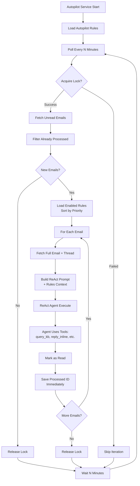
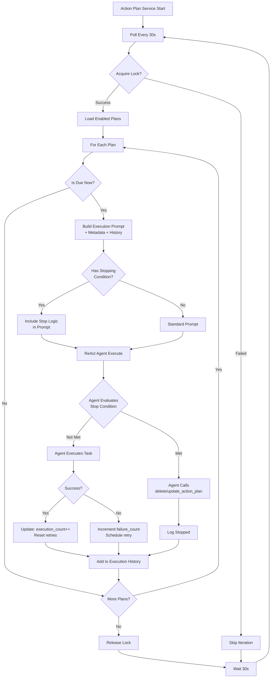
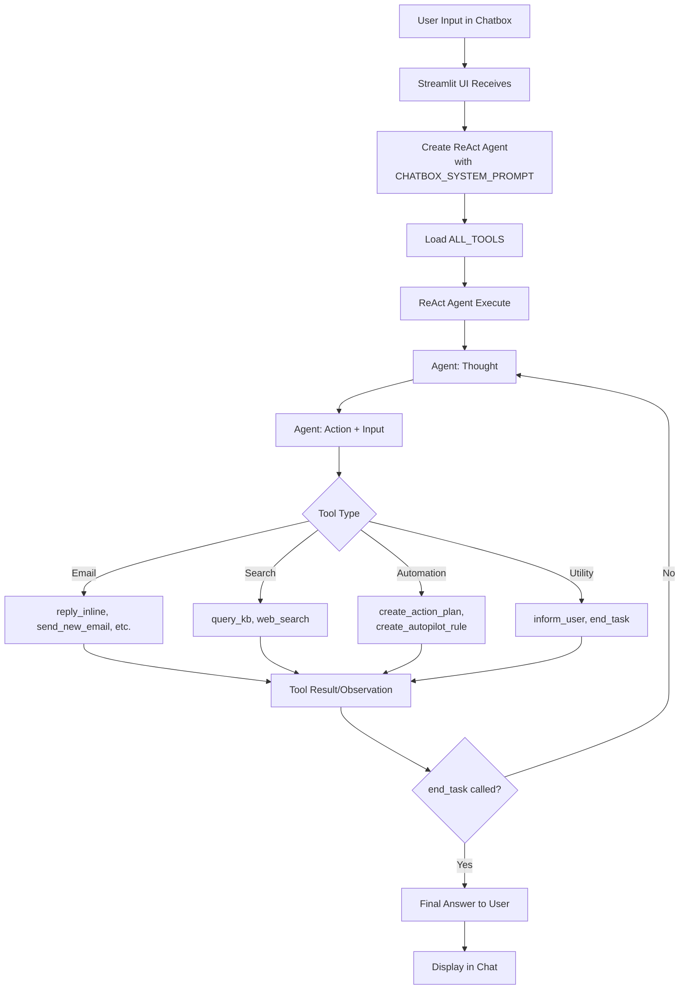

# System Audit Report - Sales Agent Platform

**Date:** 2025-12-16  
**Scope:** Autopilot, Action Plans, Chatbox  
**Objective:** Autonomous mail handling with robust task execution

---

## 1. ARCHITECTURE & FLOW ANALYSIS

### 1.1 Autopilot Flow



**Code Path:**
1. `autopilot_service.py` → Main loop
2. `autopilot.py::autopilot_once()` → Execution logic
3. `autopilot.py::get_autopilot_react_agent()` → Agent creation
4. `react_agent.py::run()` → Agent execution
5. `agent_tools.py` → Tool execution

**Key Files:**
- [`autopilot_service.py`](file:///c:/Users/JayantVerma/AA/SSH_AGENT/SOLO_AGENTS/SalesAgent/SalesAgent15_/required_files_project/autopilot_service.py) - Service daemon
- [`autopilot.py`](file:///c:/Users/JayantVerma/AA/SSH_AGENT/SOLO_AGENTS/SalesAgent/SalesAgent15_/required_files_project/autopilot.py) - Core logic
- [`autopilot_state.json`](file:///c:/Users/JayantVerma/AA/SSH_AGENT/SOLO_AGENTS/SalesAgent/SalesAgent15_/required_files_project/autopilot_state.json) - State storage

---

### 1.2 Action Plans Flow



**Code Path:**
1. `action_plan_service.py` → Main loop
2. `action_plans/executor.py::execute_scheduled_plans()` → Plan execution
3. `action_plans/executor.py::_execute_single_plan()` → Single plan execution
4. `action_plans/manager.py` → Plan CRUD operations
5. `scheduled_tasks.py` → Schedule calculation

**Key Files:**
- [`action_plan_service.py`](file:///c:/Users/JayantVerma/AA/SSH_AGENT/SOLO_AGENTS/SalesAgent/SalesAgent15_/required_files_project/action_plan_service.py) - Service daemon
- [`action_plans/executor.py`](file:///c:/Users/JayantVerma/AA/SSH_AGENT/SOLO_AGENTS/SalesAgent/SalesAgent15_/required_files_project/action_plans/executor.py) - Execution engine
- [`action_plans/manager.py`](file:///c:/Users/JayantVerma/AA/SSH_AGENT/SOLO_AGENTS/SalesAgent/SalesAgent15_/required_files_project/action_plans/manager.py) - Plan manager
- [`action_plans_state.json`](file:///c:/Users/JayantVerma/AA/SSH_AGENT/SOLO_AGENTS/SalesAgent/SalesAgent15_/required_files_project/action_plans_state.json) - State storage

---

### 1.3 Chatbox Flow



**Code Path:**
1. `main_react.py` → Streamlit UI
2. User input → Chat input field
3. Create `ReActAgent` with `CHATBOX_SYSTEM_PROMPT`
4. `react_agent.py::run()` → Execute
5. `agent_tools.py` → Tool calls
6. Response → Display in chat

**Key Files:**
- [`main_react.py`](file:///c:/Users/JayantVerma/AA/SSH_AGENT/SOLO_AGENTS/SalesAgent/SalesAgent15_/required_files_project/main_react.py) - UI & chatbox
- [`react_agent.py`](file:///c:/Users/JayantVerma/AA/SSH_AGENT/SOLO_AGENTS/SalesAgent/SalesAgent15_/required_files_project/react_agent.py) - Agent engine
- [`agent_tools.py`](file:///c:/Users/JayantVerma/AA/SSH_AGENT/SOLO_AGENTS/SalesAgent/SalesAgent15_/required_files_project/agent_tools.py) - Tool definitions

---

## 2. LOGIC ANALYSIS & POTENTIAL FLAWS

### 2.1 Autopilot

#### ✅ **Implemented Logic**

1. **Rule-Based Processing**
   - Rules loaded with priority (1=highest, 3=lowest)
   - Multiple rules can apply to same email
   - Priority used for conflict resolution

2. **Duplicate Prevention**
   - `processed_mails.json` tracks processed email IDs
   - Immediate save after each email (prevents re-processing)
   - Lock file prevents concurrent runs

3. **Thread Context**
   - Fetches full email thread (last 6 messages)
   - Agent sees conversation history

4. **User Identity Awareness**
   - Checks if email is addressed to configured user (`EWS_EMAIL`)
   - Agent can decide to skip if not relevant

#### ⚠️ **Potential Flaws**

| Flaw | Impact | Mitigation |
|------|--------|------------|
| **No rule ordering guarantee** | If 2 priority-1 rules conflict, undefined behavior | Document that same-priority rules may conflict |
| **Infinite loop risk** | If agent creates autopilot rules recursively | **CRITICAL**: Add check in `create_autopilot_rule` to prevent calling during autopilot mode |
| **Lock timeout = 10 min** | Very slow emails could cause stale lock | Reasonable for most cases, monitor execution time |
| **No email age limit** | Could process years-old unread emails on first run | Add `days_back` parameter to limit lookback |
| **Memory usage** | Loading all rules + threads for each email | Acceptable for <1000 emails, may need optimization at scale |
| **No retry on transient failures** | If KB query fails, email marked as processed | Add optional `retry_on_error` flag |

#### ❌ **Cannot Do**

1. **Scheduled execution of arbitrary tasks** → Use Action Plans instead
2. **Modify email content after sending** → EWS limitation
3. **Process emails in specific order** → Processes unread in fetch order
4. **Wait for external events** → Only polls on interval
5. **Cross-email reasoning** → Each email processed independently

---

### 2.2 Action Plans

#### ✅ **Implemented Logic**

1. **Flexible Scheduling**
   - Supports: once, hourly, daily, twice_daily, weekly, custom intervals
   - Custom intervals: minutes, hours, or days
   - Time windows for daily/weekly (e.g., "09:00", "17:00")

2. **Stopping Conditions**
   - Natural language conditions evaluated by LLM
   - Agent can check execution_count, dates, email content
   - Auto-disable or auto-delete when met

3. **Execution Tracking**
   - `execution_count`, `failure_count`, `last_executed`
   - Execution history (last 100 runs)
   - Recent history (last 3 runs) passed to agent

4. **Retry Logic**
   - Max 3 retries with 15-min delay
   - Tracks `current_retries`
   - Resets on success

#### ⚠️ **Potential Flaws**

| Flaw | Impact | Mitigation |
|------|--------|------------|
| **LLM stopping condition reliability** | Agent might misinterpret condition | Test common patterns, provide clear examples |
| **No atomic operations** | Plan could execute twice if lock fails | Lock mechanism should prevent, but edge cases exist |
| **Memory of execution history** | LLM context limited to last 3 runs | Consider increasing to 5-10 if needed |
| **No plan dependencies** | Can't say "run Plan B after Plan A" | Add future enhancement for prerequisites |
| **Stopping condition check timing** | Only checked at execution time, not between | Expected behavior, but document it |
| **Time zone handling** | All times in Asia/Kolkata | Should make configurable per plan |

#### ❌ **Cannot Do**

1. **Real-time event-driven execution** → Only scheduled polling
2. **Conditional execution based on external state** → Except via LLM checking emails/KB
3. **Parallel execution of same plan** → Lock prevents, by design
4. **Rollback on failure** → No transaction support
5. **Cross-plan coordination** → Each plan executes independently

---

### 2.3 Chatbox

#### ✅ **Implemented Logic**

1. **Conversational Interface**
   - ReAct agent with full tool access
   - Context-aware (sees conversation history)
   - Can use all 35+ tools

2. **Automation Creation**
   - Can create autopilot rules via chat
   - Can create action plans via chat
   - Aware of both systems

3. **Knowledge Integration**
   - Queries knowledge base before answering
   - Uses web search for additional context
   - Cites sources

4. **Email Operations**
   - Reply, forward, send new emails
   - Preserves CC/BCC
   - Maintains thread context

#### ⚠️ **Potential Flaws**

| Flaw | Impact | Mitigation |
|------|--------|------------|
| **Tool recursion** | Agent might call create_action_plan inside action plan | Prompt explicitly warns against this |
| **Long execution time** | Complex tasks block UI | Streamlit limitation, consider async |
| **No conversation memory persistence** | Restarting app loses chat history | Could add session state persistence |
| **LLM hallucinations** | Agent might invent tool parameters | Schema validation in tools helps |
| **No user confirmation** | Agent executes tools immediately | Add confirmation step for destructive operations |
| **Concurrent user interactions** | Multiple users could conflict | Streamlit is single-user by design |

#### ❌ **Cannot Do**

1. **Proactive notifications** → Cannot alert user outside chat
2. **Background processing** → All synchronous  
3. **File uploads directly to KB** → Requires manual KB update
4. **Voice interaction** → Text-only interface
5. **Multi-modal inputs** → Cannot analyze images from emails

---

## 3. RECOMMENDATIONS

### 3.1 Critical Fixes Needed

#### **HIGH PRIORITY** 🔴

1. **Prevent Autopilot Rule Recursion**
   ```python
   # In agent_tools.py::create_autopilot_rule
   @tool
   def create_autopilot_rule(...):
       # Add check
       import inspect
       frame = inspect.currentframe()
       if 'autopilot_once' in str(frame):
           return json.dumps({"error": "Cannot create autopilot rules during autopilot execution"})
   ```

2. **Fix Stopping Condition Attribute Access** (Already fixed, needs testing)
   - Verify executor.py uses `plan.stopping_condition` not `plan.get()`
   - Clear Python cache and restart services

3. **Add Email Age Limit to Autopilot**
   ```python
   # In autopilot.py::autopilot_once
   from datetime import datetime, timedelta
   cutoff = datetime.now() - timedelta(days=7)  # Only process last 7 days
   new_mails = [m for m in new_mails if parse_date(m['received']) > cutoff]
   ```

#### **MEDIUM PRIORITY** 🟡

4. **Add Execution Timeout**
   ```python
   # In action_plans/executor.py::_execute_single_plan
   import signal
   
   def timeout_handler(signum, frame):
       raise TimeoutError("Plan execution exceeded 5 minutes")
   
   signal.signal(signal.SIGALRM, timeout_handler)
   signal.alarm(300)  # 5 minutes
   try:
       final_answer = agent.run(...)
   finally:
       signal.alarm(0)
   ```

5. **Improve Stopping Condition Examples**
   - Add more examples in tool docstrings
   - Create test cases for common patterns
   - Document known limitations

6. **Add Plan Validation**
   ```python
   # In action_plans/manager.py::create_plan
   if stopping_condition:
       # Validate it's understandable
       test_prompt = f"Can you evaluate this condition: {stopping_condition}"
       # Maybe do a quick LLM check to ensure it's parseable
   ```

### 3.2 Architecture Improvements

#### **Scalability**

1. **Database Backend** (vs JSON files)
   - Current JSON files work for <1000 emails/day
   - Consider PostgreSQL or SQLite for >10K emails/day
   - Enables better querying and analytics

2. **Queue-Based Processing**
   - Replace polling with message queue (Redis/RabbitMQ)
   - Enables event-driven execution
   - Better resource utilization

3. **Caching Layer**
   - Cache KB queries (Redis)
   - Cache web search results
   - Reduces latency and costs

#### **Reliability**

4. **Health Checks**
   ```python
   #healthcheck endpoint for services
   @app.route('/health')
   def health():
       return {
           "autopilot": is_autopilot_running(),
           "action_plans": is_action_plan_running(),
           "last_execution": get_last_execution_time()
       }
   ```

5. **Dead Letter Queue**
   - For emails/plans that fail repeatedly
   - Manual review queue
   - Prevents silent failures

6. **Monitoring & Alerts**
   - Log aggregation (ELK stack)
   - Metrics (Prometheus)
   - Alerts for failures (PagerDuty/email)

### 3.3 Feature Enhancements

#### **Autopilot**

7. **Rule Testing Mode**
   - Dry-run mode that logs actions without executing
   - Preview what rule would do on sample emails
   - Helps users validate rules

8. **Rule Analytics**
   - Track which rules trigger most often
   - Success/failure rates per rule
   - Help users optimize rules

9. **Conditional Rules**
   ```python
   # Rule with preconditions
   {
       "name": "VIP after hours",
       "enabled": True,
       "prompt": "...",
       "conditions": {
           "time_range": ["18:00", "09:00"],  # Only after hours
           "sender_domain": ["@bigcorp.com"]
       }
   }
   ```

#### **Action Plans**

10. **Plan Dependencies**
    ```python
    # plan.prerequisites = ["plan_id_1", "plan_id_2"]
    # Only execute if prerequisites completed successfully today
    ```

11. **Conditional Execution**
    ```python
    # plan.execution_condition = "Only if unread emails > 10"
    # Agent evaluates before running
    ```

12. **Plan Templates**
    - Pre-built plans for common use cases
    - "Daily summary", "Follow-up unreplied", etc.
    - One-click activation

#### **Chatbox**

13. **Conversation Persistence**
    ```python
    # Store chat history in session state or DB
    st.session_state['chat_history'] = load_history()
    ```

14. **Command Shortcuts**
    ```python
    # Quick commands
    /autopilot list  # List autopilot rules
    /plans create   # Start plan creation wizard
    /help          # Show available commands
    ```

15. **Approval Workflow**
    ```python
    # For sensitive operations
    if operation == "delete_autopilot_rule":
        if not st.button("Confirm deletion"):
            return "Operation cancelled"
    ```

### 3.4 Testing Strategy

#### **Unit Tests**

```python
# test_autopilot.py
def test_duplicate_prevention():
    # Test that processed emails aren't reprocessed
    
def test_rule_priority():
    # Test that priority 1 overrides priority 2
    
def test_lock_mechanism():
    # Test concurrent execution prevention
```

#### **Integration Tests**

```python
# test_action_plans_integration.py
def test_plan_execution_with_stopping_condition():
    # Create plan, execute, verify stopping condition
    
def test_retry_logic():
    # Simulate failure, verify retries
```

#### **End-to-End Tests**

```python
# test_e2e.py
def test_full_prospect_followup_flow():
    # User creates plan via chatbox
    # Plan creates autopilot rule
    # Autopilot processes email
    # Action plan follows up
    # Stopping condition triggers
```

---

## 4. CURRENT STATUS ASSESSMENT

### ✅ **Working Well**

1. Autopilot processes emails reliably with rules
2. Action plans execute on schedule
3. Chatbox can create both autopilot rules and action plans
4. Stopping conditions implemented (needs testing)
5. Execution history tracking works
6. Lock mechanisms prevent concurrent runs
7. Email threading preserved in replies
8. Knowledge base integration functional
9. Web search works
10. CC/BCC preservation in replies

### ⚠️ **Needs Attention**

1. Executor stopping condition attribute access (fixed, needs restart)
2. No protection against rule recursion during autopilot
3. No email age limit (could process old emails)
4. Stopping conditions not thoroughly tested
5. No execution timeout (plans could run forever)
6. Python cache issues requiring service restarts

### ❌ **Not Implemented**

1. Plan dependencies
2. Health check endpoints
3. Monitoring/alerting
4. Conversation persistence
5. Approval workflows
6. Rule testing mode
7. Plan templates
8. Database backend

---

## 5. DEPLOYMENT CHECKLIST

Before production deployment:

- [ ] Test stopping conditions with real scenarios
- [ ] Add recursion prevention to create_autopilot_rule
- [ ] Add email age limit to autopilot
- [ ] Add execution timeout to action plans
- [ ] Set up monitoring (logs, metrics, alerts)
- [ ] Create health check endpoints
- [ ] Write deployment documentation
- [ ] Create backup/restore procedures
- [ ] Test service auto-restart on failure
- [ ] Load test with 1000+ emails
- [ ] Security audit (credential storage, permissions)
- [ ] Create admin dashboard for monitoring

---

## 6. LONG-TERM ROADMAP

### Phase 1: Stability (Week 1-2)
- Fix all HIGH priority issues
- Thorough testing of stopping conditions
- Add monitoring

### Phase 2: Reliability (Week 3-4)
- Implement health checks
- Add execution timeouts
- Create dead letter queue

### Phase 3: Scale (Month 2)
- Database backend option
- Queue-based processing
- Caching layer

### Phase 4: Features (Month 3+)
- Plan dependencies
- Rule analytics
- Plan templates
- Advanced approval workflows

---

## CONCLUSION

The system has a solid foundation for autonomous mail handling:

**Strengths:**
- Three-component architecture (Autopilot, Action Plans, Chatbox) provides flexibility
- ReAct agent enables intelligent decision-making
- Stopping conditions add powerful control
- Execution history enables learning and debugging

**Critical Needs:**
- Protection against recursion during autopilot
- Thorough testing of stopping conditions
- Better error handling and timeouts
- Monitoring and observability

**Recommendation:** Address HIGH priority items before production, then iteratively improve based on MEDIUM priority items and user feedback.

The architecture is sound and capable of handling the stated objective of autonomous mail handling with diverse capabilities. With the recommended fixes, it will be production-ready.
